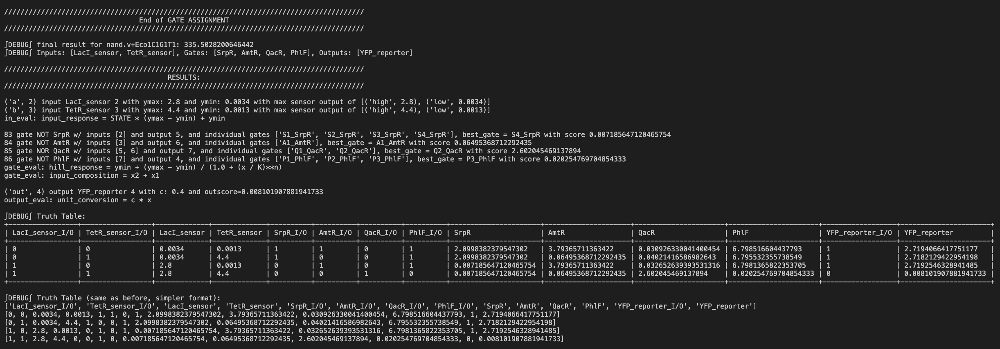

# Cello-v3-Core
This software package is a streamlined algorithm for designing genetic circuits based on logic gate designs written in the Verilog format. It executes through the command-line interface by calling the 'celloAlgo.py' script. CELLO-3.0 is capable of efficiently handling single-cellular (with multicellular support coming soon) partitioning with multiple-output support, generating results saved in a local directory on your machine, with verbose logging, ang with GUI interface coming soon.

#
## Cloning the Repo
```
git clone https://github.com/CIDARLAB/Cello-v3-Core.git
cd Cello-v3-Core/
```

#
## Installing Python Packages
You will need to install the Python packages for Graphviz, SciPy, Matplotlib, DNAplotlib, and Py4J by running:
```
pip install graphviz scipy matplotlib dnaplotlib py4j
```

#
## Installing [YOSYS](https://yosyshq.net/yosys/download.html) and Graphviz
### For OSX / Linux
To install Yosys (which includes Graphviz), the easiest way is through [Homebrew](https://brew.sh). With homebrew installed, you can simply run:
```
brew install yosys
```

#
### For Windows
**Graphviz**

First, you will need to manually install Graphviz, required for running Yosys. You can download the latest .exe installer [here](https://www.graphviz.org/download/). Then, follow the instructions for the install dialog box.

Next, you will need to add the graphviz bin folder to your ```Path``` environment variable. Search for "edit environment variables" in the Windows menu, go to the dialog box, and click "Edit" on the variable named ```Path```. Then click "New" once you see the values of the ```Path``` variable. Now you can the path of the Graphviz bin to the list, by default it is ```C:\Program Files\Graphviz\bin```

Now, you should have graphviz installed as an executable command. Test it by trying: ```dot -v```

If no errors show up, Graphviz is correctly installed, and you can set up Yosys next.

**Yosys**

Go to [here](https://github.com/YosysHQ/oss-cad-suite-build/releases/tag/2023-06-16) and download the OSS Cad Suite, remember to select the architecture for your PC.

Click the downloaded file to extract it, and move the extracted folder to a location suitable for software packages. 

You should see a folder named ```oss-cad-suite```, and move the folder to a location such as ```C:\Documents\folder``` for example, and open up PowerShell:
```
cd C:\Documents\folder\
oss-cad-suite\start.bat
```

Running the above commands will load the "oss-cad-suite" libraries in your existing shell environment.

With your shell now set up, you can now cd into ```\Cello-v3-Core``` and begin experimenting.

#
### For Other Platforms
Please check [YOSYS installation guide](https://yosyshq.net/yosys/download.html) for other platforms

#
## Using CELLO
CELLO-V3 takes the following parameters, and you can modify them in the __main__ function for celloAlgo.py, for example:
```
inpath = '/home/user/example/path/to/input_folder'
outpath = '/home/user/example/path/to/output_folder'
```

By default, the ```inpath``` is the [inputs](/inputs/) folder, and the ```outpath``` is the [outputs](/outputs/) 
folder, so users can use Cello without having to specify the paths.

You can also set the ```verbose``` option as either ```True / False``` in the ```main``` function of celloAlgo.py. The non-verbose output will show a progress bar, whereas verbose option will show every individual iteration. (It is recommended to only set verbose to True if you are debugging to avoid cluttering.)

**To run Cello, type in terminal:**
```
python celloAlgo.py
```

Follow the prompts for which Verilog and UCF you would like to use.

You will see the results and the optimized design in the *outpath* folder.

Alternatively, you could make a script to call the ```CELLO3``` process and use this codebase as an API.

#
### Sample Inputs
Can be found in the [inputs](/inputs/) folder. This includes the UCF files for Cello, as well as a few dozen 
Verilog files to test Cello with. You may use your own Verilog files or modified UCF files to run Cello and choose a different a different folder to store them by speifying "inpath". But make sure that all the input files are valid, and they are organized in the right folder.

#
### Example Output
Here is an example of what the result from Cello looks like in the terminal. It uses the and.v circuit pared with Bth1C1G1T1 UCF. After running this experiment, you will see other files generated in the output folder as well. The important takeaways are the *circuit score* and the *design*, which will be returned to the terminal. Because additional convenience features are on the backlog, it is important to check the terminal for the *circuit score* and the *design* Cello made.

Example resulting design outputted by Cello.



Please check the [assets](assets/) folder for further supplementary information.

#
### Try Oriole
The size of the design that CELLO-3.0 can handle is limited by the number of genetic parts specified in the UCF files. To achieve intra-cellular partitioning for large circuit designs, consider first using [Oriole](https://github.com/CIDARLAB/genetic-circuit-partitioning-new.git) to partition the design into smaller circuits, and then feed them into CELLO-3.0. 

#
### Complexity
**Time Complexity (exhaustive algorithm):**

$$
O((I)P(i) \cdot (G)P(g) \cdot (O)P(o))
$$

Where capital letters represent the available set of Inputs, Gates, and Outputs from the UCF, and lowercase letters represent the set of Inputs, Gates, and Outputs required by the logic circuit.

**Space Complexity (exhaustive algorithm):**

$$
O(2^i \cdot (i+g+o))
$$

Only one iteration is stored in the memory at a time in the exhaustive pass. Each iteration has to store a truth table where each row has inputs toggled ON/OFF. The circuit for the intermediate logic circuit design placement is stored in memory with different data for each row.

#
## Other Info
### Contributing
We welcome contributions from the community! If you'd like to contribute to CELLO-3.0, please follow the guidelines in the CONTRIBUTING.md file.

#
### Credits
CELLO-3.0 was developed by [Weiqi Ji](https://ginomcfino.github.io) at [CIDAR LAB](https://www.cidarlab.org) under [Douglas Densmore](https://www.cidarlab.org/doug-densmore) along [other contributors](). It was inspired by the original [Cello](https://github.com/CIDARLAB/cello) and [CELLO-V2](https://github.com/CIDARLAB/Cello-v2.git) software package developed by [CIDAR LAB](https://www.cidarlab.org) under [Douglas Densmore](https://www.cidarlab.org/doug-densmore) along [other contributors](https://github.com/CIDARLAB).

#
### License
CELLO-3.0 is released under the [Apache 2.0](License.txt) license. See the LICENSE file for more information.
